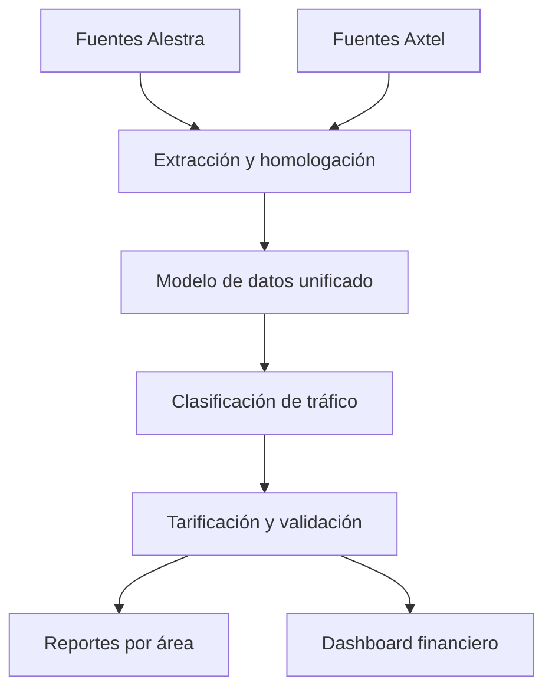

# Axtel–Alestra Data Consolidation

## Migración, homologación y análisis de tráfico de interconexión

Este repositorio presenta una recreación para portafolio de un proyecto empresarial en el que participé durante la integración de las operaciones de **Axtel y Alestra**. El objetivo principal fue migrar la información de la base de datos de Alestra hacia la plataforma de Axtel y construir un modelo unificado que permitiera clasificar, tarificar, validar y reportar el tráfico de ambas redes.

El proyecto original operaba en un entorno de telecomunicaciones de misión crítica y procesaba volúmenes cercanos a **3,000 millones de registros de detalle de llamadas (CDRs) por mes**. La versión pública de GitHub utilizará exclusivamente datos sintéticos, nombres genéricos y código demostrativo.

> **Aviso de confidencialidad:** este repositorio no contiene código fuente, datos, tarifas, credenciales, reglas comerciales ni documentación propiedad de Axtel, Alestra o terceros. Su contenido será una recreación educativa basada en mi experiencia profesional y en las competencias desarrolladas durante el Bootcamp de Data Analyst de TripleTen.

---

## Contexto del proyecto

Axtel y Alestra contaban con redes, catálogos, reglas de clasificación, tarifas, procesos de tarificación y estructuras de datos independientes. La integración requería migrar la información de Alestra, homologar los criterios utilizados por ambas compañías y adaptar los procesos para operar sobre un solo modelo de datos.

El reto no consistía únicamente en copiar información entre bases de datos. Era necesario comprender los escenarios de tráfico, identificar diferencias entre reglas comerciales, modificar procesos críticos y asegurar que los resultados continuaran siendo confiables para las áreas técnicas, regulatorias y financieras.

## Objetivo general

Diseñar e implementar una solución unificada para integrar el tráfico de interconexión de Axtel y Alestra, manteniendo la integridad de la información, la correcta clasificación y tarificación de los CDRs, el rendimiento de los procesos y la continuidad de los reportes utilizados por el negocio.

## Alcance

El proyecto contempló los siguientes frentes de trabajo:

1. Analizar los escenarios de tráfico existentes en Alestra.
2. Revisar y homologar las tarifas aplicables a cada tipo de tráfico.
3. Modificar los procesos de clasificación y tarificación de ambas redes.
4. Integrar los modelos de datos de Axtel y Alestra.
5. Crear nuevos reportes para Ingeniería, Regulatorio, Finanzas y Costos.
6. Desarrollar una nueva propuesta de dashboard para Finanzas y Costos.

---

## Escenarios de tráfico analizados

| Tipo de tráfico | Descripción general | Validaciones principales |
|---|---|---|
| Local fijo | Llamadas locales originadas o terminadas en líneas fijas | Origen, destino, operador, zona, duración y tarifa |
| Local móvil | Llamadas locales con participación de una red móvil | Operador móvil, modalidad, duración y regla tarifaria |
| Larga distancia fija | Tráfico de larga distancia asociado con líneas fijas | Región, ruta, operador, destino y tarifa aplicable |
| Larga distancia móvil | Tráfico de larga distancia con participación móvil | Operador, región, modalidad y esquema de cobro |
| Números 800 | Llamadas realizadas a números de cobro revertido | Número de servicio, responsable del cargo, ruta y tarifa |
| Internacional | Tráfico entrante o saliente entre México y otros países | País, carrier, ruta internacional, moneda, duración y tarifa |

Para cada escenario se revisaron las reglas de identificación, los campos requeridos, las excepciones y la forma en que el tráfico debía presentarse en los reportes operativos y financieros.

## Revisión y homologación de tarifas

La revisión tarifaria consideró:

- Catálogos de tarifas existentes en ambas plataformas.
- Vigencias y periodos de aplicación.
- Tipo de tráfico, operador, zona, destino o carrier.
- Unidades de medición y criterios de redondeo.
- Prioridad de las reglas tarifarias.
- Casos sin tarifa o con información incompleta.
- Diferencias entre el importe esperado y el importe calculado.
- Trazabilidad de la tarifa aplicada a cada registro.

Esta etapa permitió definir una estructura común para administrar las tarifas y aplicar reglas consistentes después de la migración.

---

## Solución implementada

### 1. Análisis y perfilamiento de datos

Se analizaron las estructuras, catálogos, volúmenes, reglas y procesos de Alestra para identificar equivalencias y diferencias con la plataforma de Axtel. También se revisaron valores nulos, duplicados, formatos incompatibles y registros que requerían reglas especiales de transformación.

### 2. Adaptación de la clasificación y tarificación

Se modificaron los procesos responsables de:

- Identificar la red de origen y de destino.
- Clasificar cada CDR por tipo de tráfico.
- Determinar el operador, zona, ruta o carrier correspondiente.
- Seleccionar la tarifa vigente.
- Calcular importes y conservar la trazabilidad del resultado.
- Registrar excepciones para su análisis y corrección.

Las modificaciones debían soportar el tráfico de ambas redes sin afectar el rendimiento de los procesos existentes.

### 3. Integración del modelo de datos

El modelo fue adaptado para representar de manera unificada:

- Redes y operadores.
- Tipos y subtipos de tráfico.
- CDRs normalizados.
- Catálogos de destinos, zonas, rutas y carriers.
- Tarifas y periodos de vigencia.
- Resultados de clasificación y tarificación.
- Excepciones y controles de calidad.
- Información agregada para reportes y análisis.

La integración incluyó estrategias de particionamiento, índices, procesamiento por lotes y optimización de consultas para mantener un desempeño adecuado con grandes volúmenes de información.

### 4. Reportes para las áreas de negocio

Se definieron salidas de información orientadas a diferentes necesidades:

| Área | Propósito de los reportes |
|---|---|
| Ingeniería | Analizar volúmenes, rutas, operadores, comportamiento de la red y anomalías técnicas |
| Regulatorio | Validar escenarios de tráfico y generar información de apoyo para obligaciones regulatorias |
| Finanzas | Consultar minutos, importes, variaciones, tendencias y conciliaciones |
| Costos | Analizar costos por red, operador, carrier, tipo de tráfico y periodo |

### 5. Dashboard para Finanzas y Costos

La adaptación para portafolio aplicará lo aprendido en TripleTen para construir un dashboard en **Power BI** con indicadores como:

- Total de CDRs procesados.
- Minutos de tráfico por periodo.
- Importe y costo total.
- Distribución por tipo de tráfico.
- Participación por red, operador o carrier.
- Tendencias mensuales.
- Diferencias entre importes calculados y esperados.
- Registros sin clasificar o sin tarifa.
- Controles de calidad y conciliación.

El dashboard permitirá filtrar la información por fecha, red, tipo de tráfico, operador, destino y estatus de procesamiento.

---

## Arquitectura conceptual



## Aplicación de las competencias de TripleTen

El proyecto original se desarrolló principalmente con tecnologías Oracle y procesos empresariales de telecomunicaciones. Para convertirlo en un proyecto demostrable de Data Analytics, la versión de portafolio incorporará las siguientes competencias:

| Competencia | Aplicación en la versión de GitHub |
|---|---|
| SQL | Extracción, transformación, validación, agregación y conciliación de datos |
| Modelado de datos | Diseño de un esquema relacional unificado y una capa analítica |
| Python y Pandas | Perfilamiento, limpieza, controles de calidad y análisis exploratorio |
| NumPy | Cálculos y validaciones numéricas |
| Matplotlib y Seaborn | Análisis visual preliminar y exploración de tendencias |
| Power BI | KPIs, modelo analítico, medidas DAX, filtros y dashboard ejecutivo |
| Power Query | Preparación y transformación de fuentes para reportería |
| Data storytelling | Explicación de hallazgos y recomendaciones para Finanzas y Costos |

Esta separación permite mostrar tanto mi experiencia profesional con Oracle/PLSQL como las habilidades analíticas adquiridas y reforzadas durante el bootcamp.

## Tecnologías

### Proyecto empresarial original

- Oracle Database
- SQL y PL/SQL
- Procedimientos, funciones, paquetes y triggers
- Tablas particionadas, índices y estadísticas
- UNIX y Korn Shell
- Procesamiento por lotes
- Archivos planos e integraciones SFTP
- Optimización y procesamiento de grandes volúmenes

### Recreación para GitHub

- Oracle SQL o una versión compatible con PostgreSQL
- Python
- Pandas y NumPy
- Matplotlib y Seaborn
- Power BI, Power Query y DAX
- Git y GitHub
- Datos sintéticos en CSV

---

## Controles de calidad propuestos

La recreación incluirá validaciones para comprobar:

- Conteo de registros antes y después de cada transformación.
- Detección de duplicados.
- Identificación de valores nulos en campos obligatorios.
- Integridad entre CDRs y catálogos.
- Cobertura de clasificación por tipo de tráfico.
- Cobertura de tarificación.
- Comparación de minutos e importes por red y periodo.
- Detección de diferencias fuera de tolerancia.
- Registro y seguimiento de excepciones.

## Resultados y valor para el negocio

La integración permitió establecer una base común para procesar y analizar el tráfico de ambas redes. Entre los principales beneficios del proyecto se encuentran:

- Centralización de la información de Axtel y Alestra.
- Homologación de criterios de clasificación y tarificación.
- Mayor trazabilidad de tarifas e importes.
- Continuidad de los procesos con volúmenes de miles de millones de registros.
- Información consistente para Ingeniería, Regulatorio, Finanzas y Costos.
- Reducción de procesos y reportes aislados entre las dos plataformas.
- Base preparada para análisis, conciliaciones y visualizaciones ejecutivas.

## Mi participación

Mi participación incluyó el análisis funcional y técnico de los escenarios de tráfico, la revisión de estructuras y reglas existentes, el diseño de modificaciones al modelo de datos y el desarrollo de procesos con Oracle SQL y PL/SQL. También trabajé en la validación de resultados, optimización para grandes volúmenes, solución de incidencias y coordinación con áreas técnicas y de negocio.

Para la versión pública del proyecto, diseñaré una recreación funcional con datos sintéticos que permita demostrar el flujo completo sin revelar información confidencial.

---

## Estructura prevista del repositorio

```text
axtel-alestra-data-consolidation/
├── README.md
├── data/
│   ├── raw/
│   └── processed/
├── sql/
│   ├── ddl/
│   ├── transformations/
│   ├── classification/
│   ├── rating/
│   └── validation/
├── notebooks/
│   ├── data_profiling.ipynb
│   └── traffic_analysis.ipynb
├── power_bi/
│   └── dashboard_finanzas_costos.pbix
├── images/
│   ├── data_model.png
│   └── dashboard_preview.png
└── docs/
    ├── business_rules.md
    └── data_dictionary.md
```

## Estado del portafolio

| Componente | Estado |
|---|---|
| Descripción general del proyecto | Completado |
| Diseño del dataset sintético | Pendiente |
| Modelo de datos demostrativo | Pendiente |
| Scripts SQL de clasificación y tarificación | Pendiente |
| Notebook de análisis y validación | Pendiente |
| Reportes analíticos | Pendiente |
| Dashboard de Power BI | Pendiente |
| Documentación técnica final | Pendiente |

## Próximos pasos

1. Diseñar el modelo de datos demostrativo.
2. Definir el diccionario de datos.
3. Generar CDRs y catálogos sintéticos.
4. Implementar scripts SQL de carga, clasificación y tarificación.
5. Crear validaciones y análisis con Python.
6. Construir consultas para los reportes de cada área.
7. Desarrollar el dashboard de Finanzas y Costos en Power BI.
8. Incorporar capturas, resultados y conclusiones al repositorio.

---

## Autor

**Julio Cesar Valdez Espinosa**  
Senior Oracle PL/SQL Developer | Data Analyst | Technical Lead  
Monterrey, Nuevo León, México

